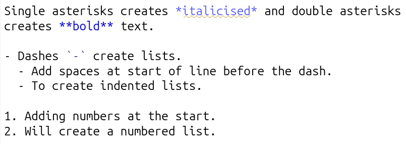
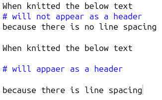
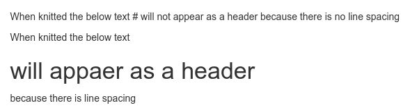
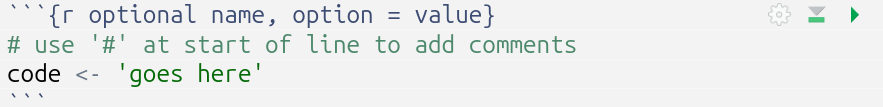
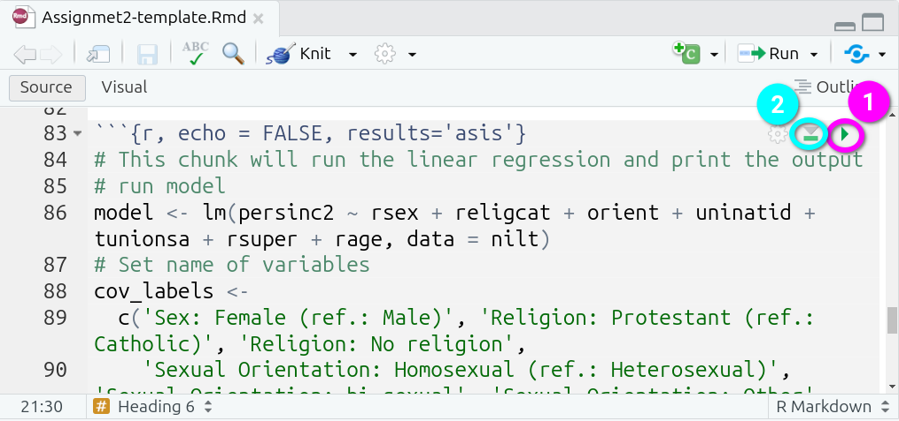
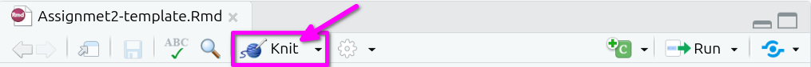
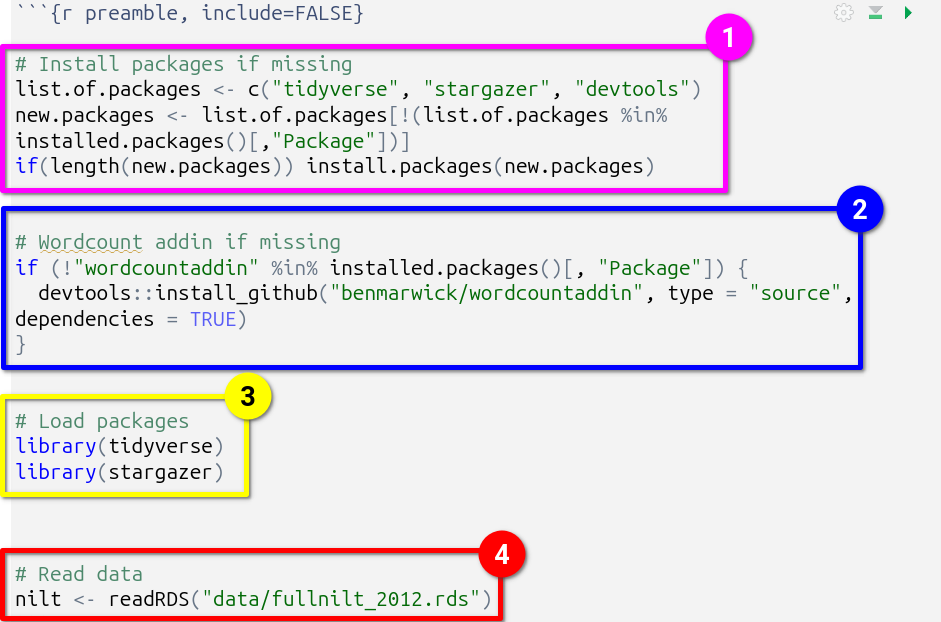

# Appendix 1: RMarkdown & the Interpretive Report Template {#InterpretiveReportTemplate .unnumbered}

## Introduction {.unnumbered}


review:
- session on rmarkdown
- session for interpretive report


## RMarkdown {.unnumbered}

and [Code Chunks]

### Formatting

```{r echo=FALSE}

```

```{r echo=FALSE}
knitr::include_graphics("./images/markdownknitted.png")
```

```{r echo=FALSE}
knitr::include_graphics("./images/headingsraw.png")
```

```{r echo=FALSE}
knitr::include_graphics("./images/headingsknitted.png")
```

### Line spacing

```{r echo=FALSE}

```

```{r echo=FALSE}

```

### Code Chunks

There are three main ways to create code chunk:

-   Click the 'Insert Code Chunk' button and from the drop-down select 'R' at the top. (See gif below)
-   Press `Ctrl + Alt + I` (Windows & Linux) or `Cmd + Option + I` (macOS)
-   Manually typing three back-ticks, "\`\`\`{r}", before your code and adding three back-ticks after, "\`\`\`".

```{r echo=FALSE}
knitr::include_graphics("./images/insertcodechunk.gif")
```

Curly brackets at the start of a code chunk are used to specify `{programming-language optional name, options = values}`. Since we are using R, all our code chunks have `{r ...}`. Within code chunks, the pound sign / hash, `#`, at the start of a line is used to add any comments:

```{r echo=FALSE}

```

#### Code Chunks Labels

Adding a label is useful as a quick way to remind yourself what the purpose of each code chunk. The quick outline (button at bottom of Source panel) can be used to jump to specific sections of your document. If you provide a label for your code chunk it will also appear here:

```{r echo=FALSE}
knitr::include_graphics("./images/chunkaddingname.gif")
```

#### Code Chunk Options

Options are used to specify how code chunks are handled when run/knitted. Two key ones we have used in the labs and in the project template:

-   **echo** - whether the code chunk is displayed in knitted outputs.
-   **include** - whether the code chunk *and* its output is displayed in knitted outputs.

By default the output *and* the code chunk are displayed in knitted outputs. For the interpretive report, you do not want to display the code chunks in your knitted HTML file, so ensure to add `echo=FALSE` to the options for new code chunks you create. Also, see [Setup Code Chunk] section for information on how to set `echo=FALSE` as a 'global option'.

Examples when working in RMarkdown document:

```{r echo=FALSE}
knitr::include_graphics("./images/echoincluderaw.png")
```

And when knitted:

```{r echo=FALSE}
knitr::include_graphics("./images/echoincludeknitted.png")
```

### Running Code Chunks

```{r echo=FALSE}

```

1.  Run Current Chunk -
2.  Run All Chunks Above -

```{r echo=FALSE}
knitr::include_graphics("./images/runoptions.png")
```

### Knitting RMarkdown Documents

```{r echo=FALSE}

```

### RMarkdown Cheat Sheet

It is possible to access an RMarkdown cheat sheet (as well as ones for ggplot2 and dplyr!) from within RStudio:

```{r echo=FALSE}
knitr::include_graphics("./images/markdowncheetsheet.gif")
```

## YAML Block {.unnumbered}

```{r echo=FALSE}
knitr::include_graphics("./images/templateyaml.png")
```

To save having to remember to update the date before knitting and submitting your final version, you can use the following in the YAML block:

```         
date: "`r format(Sys.time(), '%d/%m/%y')`"
```

When knitted that code will add the current date in dd/mm/yy format (e.g. 04/12/24):

```{r echo=FALSE}
knitr::include_graphics("./images/knitteddate.png")
```

## Setup Code Chunk {.unnumbered}

```{r echo=FALSE}
knitr::include_graphics("./images/templatesetup.png")
```

```         
knitr::opts_chunk$set(message=FALSE, warning=FALSE, echo=FALSE)
```

## Preamble Code Chunk {.unnumbered}

It is best practice to install and load any required packages at the top of the RMarkdown file. This keeps all package management in a single location and only done once.

Recent versions of R have significantly improved handling of potential conflicts between packages. However, where packages depend on others or there are conflicts, such as both using the same names for different functions, loading the packages multiple times and in different places across your code can still create issues.

The preamble code block within the template provides a structure you can add additional packages to as needed.

```{r echo=FALSE}

```

WILL NEED TO UPDATE

Outlined in blue, is a line that assigns to a vector object, 'list.of.packages', a list of packages used within the RMarkdown file. The two lines following it create another vector object, 'new.packages', with only the packages listed in 'list.of.packages' that are not already installed, then installs all packages listed in the 'new.packages' vector object.

Outlined in red, is the section that loads the tidyverse and stargazer packages.

If you require additional packages, the best way to add these would be adding them to the list assigned to 'list.of.packages' and adding a new library() line under the existing ones in the preamble. For example, if needing to install and load 'vtable':

IMAGE HERE

**Note**, moving all code for installing and loading of packages into this preamble code chunk means you do not need, and can safely remove, any other install.package() and library() lines from the rest of your code chunks.


## Word Count Code {.unnumbered}

```{r echo=FALSE}
knitr::include_graphics("./images/wordcountinline.png")
```

Note, surrounding code with single back-ticks, (/\`), creates an "inline code chunk", enabling you to add short snippets of code.

## Template Outline {.unnumbered}

```{r echo=FALSE}
knitr::include_graphics("./images/templateoutline.png")
```

## Regression Results Code Chunk {.unnumbered}

```{r echo=FALSE}
knitr::include_graphics("./images/templateresults.png")
```

## Knitted Regression Results Table {.unnumbered}

```{r echo=FALSE}

```
