# Appendix 1: RMarkdown & the Interpretive Report Template {#InterpretiveReportTemplate .unnumbered}

## Introduction {.unnumbered}

This appendix provides additional information on using RMarkdown and an overview of the structure of the RMarkdown document provided with the interpretive report project template.

Please ensure to review the relevant lab materials:

-   [Lab 5 session on RMarkdown](#rmarkdown) for an intro to RMarkdown.
-   [Lab 10 Session for Interpreting Quantitative Findings Report summative assessment](#interpretivereport) for instructions on how to create a project on RStudio Cloud for your interpretive report using the provided template.

Similarly, if you encounter any errors, please ensure to check the [R Issues FAQ](#RFAQ) first for any existing solutions.

The first half of this page provides an overview of [RMarkdown](#rmarkdown) and the second half covers the [Interpretive Report Template] in more detail. **Importantly**, please ensure to at least read the [Preamble Code Chunk] section for information on best practice for installing and loading any additional packages.

Outline:

- [RMarkdown]
  - [Formatting]
  - [Line spacing]
  - [Code Chunks]
    - [Code Chunk Labels]
    - [Code Chunk Options]
  - [Running Code Chunks]
  - [Knitting RMarkdown Documents]
  - [RMarkdown Cheat Sheet]
- [Interpretive Report Template]
  - [YAML Block]
  - [Setup Code Chunk]
  - [Preamble Code Chunk]
  - [Word Count Code]
  - [Template Outline]
  - [Regression Results Code Chunk]

## RMarkdown {#rmarkdown .unnumbered}

RMarkdown allows you to combine your narrative and data analysis in one document, writing plain-text documents with [Code Chunks] that can be converted to multiple file formats, such as HTML or PDF. This makes RMarkdown documents reproducible by embedding the analysis directly into the document. Compared to doing your analysis separately, copying and pasting over your results and graphs to a Word document, it also reduces the risk of error when working on and updating your analysis.

RMarkdown achieves this by combining the power of R, Markdown, and Pandoc. Markdown is a lightweight markup language with simple, human-readable syntax for formatting text (see the [Formatting] section below). Pandoc is a tool for converting files from one format to another, such as Markdown to PDF or HTML. RMarkdown builds on these tools. When you 'knit' a document, the code chunks are executed to run your analysis and generate your tables and graphs using R. The output from these are then integrated with the Markdown text and passed to Pandoc to convert into a neat and consistently formatted HTML, PDF, or other specified file format.

### Formatting {.unnumbered}

RMarkdown uses simple, human-readable syntax for basic formatting. Whilst different to how you would write text in a Word document, it is easy to learn. This simple transparent formatting also helps avoid the hidden complexities of Word document, where formatting issues often arise from inconsistent syntax that is hidden from the user.

Below is a screenshot from RStudio with text using the key basic syntax for formatting your main text:

```{r echo=FALSE}
knitr::include_graphics("./images/markdownraw.png")
```

And, this is how it appears when knitted:

```{r echo=FALSE}
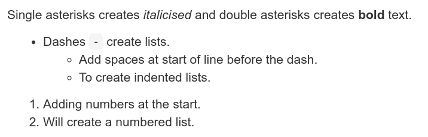
```

Headings are set using the pound / hash sign, `#`, at the start of a line, with the number of hashes determining the header level:

```{r echo=FALSE}
knitr::include_graphics("./images/headingsraw.png")
```

And, how it appears when knitted:

```{r echo=FALSE}
knitr::include_graphics("./images/headingsknitted.png")
```

### Line spacing {.unnumbered}

The main thing in RMarkdown's syntax that often trips up new users is the need to ensure there are empty line spaces between:

-   Each paragraph
-   Before and after a list
-   Before and after a header

Here's some example text in an RMarkdown document, the first without line spacing, the second with:

```{r echo=FALSE}
knitr::include_graphics("./images/linespacingraw.png")
```

And, how this looks when knitted:

```{r echo=FALSE}
knitr::include_graphics("./images/linespacingknitted.png")
```

Side-note, this practice of using empty line spaces originates from traditional coding conventions. A common coding style includes placing a specified limit on the number of characters per line, with any overflow placed on a new line. To distinguish these lines breaks to keep a limit on the number of characters per line and those used to designate new paragraphs, lists, and headers, an empty line is used. Using empty lines also helps add visual clarity when writing in RMarkdown.

### Code Chunks {.unnumbered}

There are three main ways to create a code chunk:

-   Click the 'Insert Code Chunk' button and from the drop-down select 'R' at the top. (See gif below)
-   Press `Ctrl + Alt + I` (Windows & Linux) or `Cmd + Option + I` (macOS)
-   Manually typing three back-ticks with 'r' in curly brackets, "\`\`\`{r}", before your code and adding three back-ticks after, "\`\`\`".

```{r echo=FALSE}
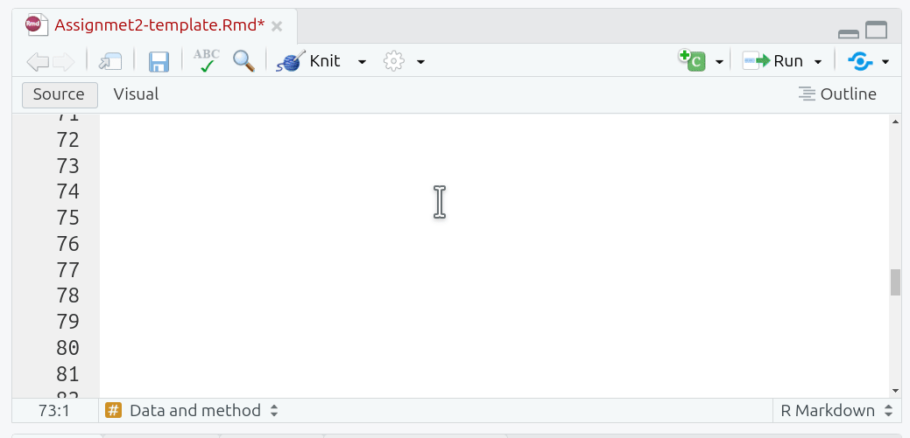
```

Curly brackets at the start of a code chunk are used to specify `{programming-language optional name, options = values}`. Since we are using R, all our code chunks have `{r ...}`. Within code chunks, the pound sign / hash, `#`, at the start of a line is used to add any comments:

```{r echo=FALSE}
knitr::include_graphics("./images/codechunk.png")
```

Side-note, this may seem confusing given hash signs are used for headers in the main text. However, inside of a code chunk, all text is treated as code for the language specified in the curly brackets. In R, hash signs are used for comments, so they are treated as comments within the code chunk rather than as Markdown headers.

#### Code Chunk Labels {.unnumbered}

Adding a label is useful as a quick way to remind yourself the purpose of each code chunk. The quick outline (button at bottom of Source panel) can be used to jump to specific sections and code chunks in your document. If you provide a label for your code chunk it will also appear here:

```{r echo=FALSE}
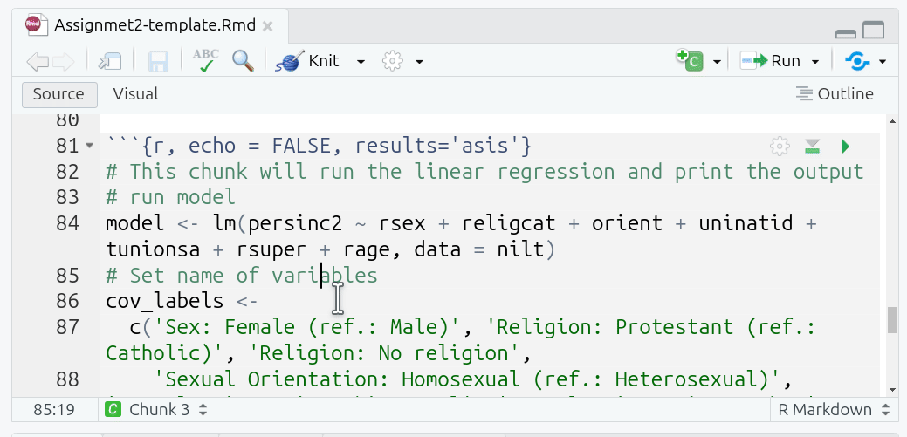
```

#### Code Chunk Options {.unnumbered}

Options are used to specify how code chunks are handled when run/knitted. Two key ones we have used in the labs and in the project template:

-   **echo** - whether the code chunk is displayed in knitted files.
-   **include** - whether the code chunk *and* its output - such as tables and graphs - are displayed in knitted files.

By default the code chunk and the output are displayed in knitted files. For the interpretive report, you do not want to display the code chunks in your knitted HTML file, so ensure to add `echo=FALSE` to the options for new code chunk you create. Alternatively, see [Setup Code Chunk] section for information on how to set `echo=FALSE` as a 'global option'.

Examples when working in RMarkdown document:

```{r echo=FALSE}
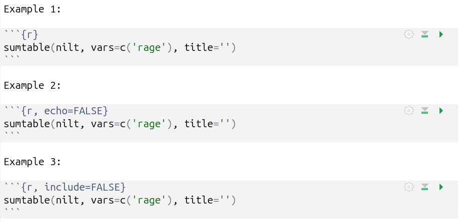
```

And when knitted:

```{r echo=FALSE}
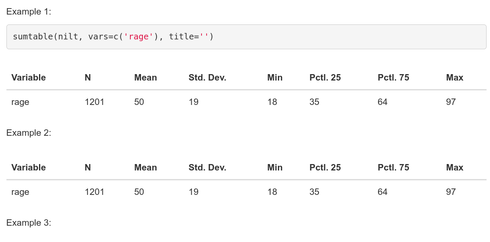
```

### Running Code Chunks {.unnumbered}

There are multiple ways to run your R code.

Within the top-right of each code chunk there are two buttons:

```{r echo=FALSE}
knitr::include_graphics("./images/runchunk.png")
```

1.  Run Current Chunk - which will run the code within that code chunks only.
2.  Run All Chunks Above - which will run all code chunks from the top of your document down to this code chunk.

The second is useful when a code chunk depends upon others being run first. Remember the R environment maintains the results of any previously run code, so you do not need to continuously run all previous chunks. However, this can be useful when debugging issues or if you restart your R environment, losing the results of previously run code, and needing to re-run everything before this chunk.

Further options can be found in the 'Run' drop-down menu, accessed from the top-right of the Source Panel:

```{r echo=FALSE}
knitr::include_graphics("./images/runoptions.png")
```

Useful additional ones here are:

-   **Run Selected Line(s)** - running all lines you have manually selected using the mouse / text cursor.
-   **Restart R and Run All Chunks** - incredibly useful when you need to reset your R environment, this can be useful when debugging an error to figure out whether the issue stems from your current code or code you previously ran but now removed.

Note as well that many of these options have keyboard shortcuts listed. Learning these pays off long-term as you will be able to write and run your code without needing to move your hands from the keyboard.

### Knitting RMarkdown Documents

Knitting a document runs all your R code from top to bottom, then combines the results from this with the Markdown text to convert these into different file formats. YAML is used to specify which file formats to convert to, see the [YAML Block] section for information on how this is setup within the project template.

**Importantly**, when you knit an RMarkdown document, all code is run sequentially from top to bottom in a clean R environment. This ensures the document is reproducible. Anyone with a copy can knit it and produce the same results. This requires though that code to load any required packages are included within a code chunk in the document. Simply loading a package via the Console adds it to your current R environment and manually run code chunks will be able to access the package. However, when knitting, the clean R environment won't have access to the package, and you'll receive an error message when the knit process tries to run a function that requires the package. This is why it is important to include a code chunk at the top of your document that loads all required packages. See the [Preamble Code Chunk] for how to do this in the RMarkdown file provided in the interpretive report project template.

Assuming you have YAML specifying which file format(s) to convert to, all you then need to do each time is simply click the 'Knit' button:

```{r echo=FALSE}
knitr::include_graphics("./images/knitting.png")
```

### RMarkdown Cheat Sheet {.unnumbered}

It is possible to access an RMarkdown cheat sheet (as well as ones for ggplot2 and dplyr!) from within RStudio:

```{r echo=FALSE}
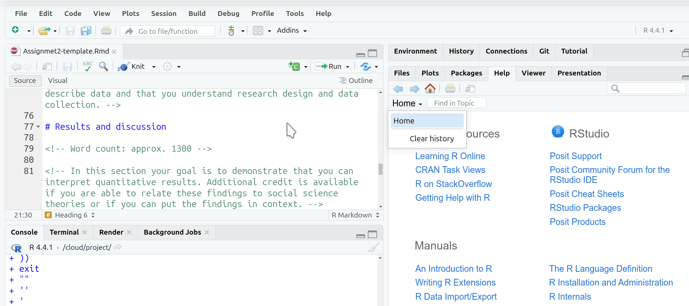
```

Note, from the same 'Help' menu, just below 'Cheat Sheets' is an option for 'Keyboard Shortcuts Help'. This displays a screen with most of the shortcuts available within RStudio. This also includes a link to 'See All Shortcuts...'.

```{r echo=FALSE}
knitr::include_graphics("./images/keyboard-shortcuts.gif")
```

## Interpretive Report Template {.unnumbered}

### YAML Block {.unnumbered}

```{r echo=FALSE}
knitr::include_graphics("./images/templateyaml.png")
```

To save having to remember to update the date before knitting and submitting your final version, you can use the following in the YAML block:

```{YAML, eval=FALSE}
date: "`r format(Sys.time(), '%d/%m/%y')`"
```

When knitted that code will add the current date in dd/mm/yy format (e.g. 04/12/24):

```{r echo=FALSE}
knitr::include_graphics("./images/knitteddate.png")
```

### Setup Code Chunk {.unnumbered}

```{r echo=FALSE}
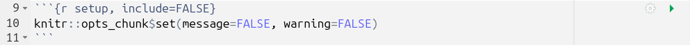
```

```{r echo=FALSE}
knitr::include_graphics("./images/templatesetupechofalse.png")
```

### Preamble Code Chunk {.unnumbered}

It is best practice to install and load any required packages and read in any data being used at the top of the RMarkdown file. This keeps all package management and data reading in a single location at the start of the document, making your code simpler and clearer. It further ensures that when running/knitting your code that all required packages are loaded and dataframes created before the rest of your code is run.

The preamble code block within the template provides a structure following this practice.

```{r echo=FALSE}
knitr::include_graphics("./images/templatepreamble.png")
```

1.  **Install packages if missing**, outlined in pink. This code may look complex, but all it does is create a list of packages that are going to be used, assigning it to the object `list.of.packages`. This list is checked against packages already installed, creating a new list `new.packages` containing only the names of packages not already installed. The final line then basically says "if the length of `new.packages` is 1 or more, then install all packages in the `new.packages` list".
2.  **Wordcount addin if missing**, outlined in blue. There is not a R package for calculating wordcounts, but there is what is known as an 'addin' for RStudio. The code here checks if the addin is already installed and if not it downloads a copy of the addin from GitHub. Please see [Word Count Code] section for further information on how this addin is used in the document.
3.  **Load packages**, outlined in yellow. This is where all packages used in the analysis are loaded.
4.  **Read data**, outlined in red. The dataset used for the assignment in read in and assigned to the `nilt` dataframe object.

**Important**, as a dataset is provided with the project template and read in already for you, you do not need to download or read in any other dataset. The assignment uses a version of the NILT dataset that includes more variables than the version of the data we used in the lab sessions. Downloading and reading in the dataset used in the labs will result in variables disappearing from the regression results table. Please see the [R Issues FAQ](#RFAQ) for more info.

If you require additional packages, the best way to add this would be:

1.  Within the **Install packages if missing** section, add the package name at the end of the list that is being assigned to 'list.of.packages'
2.  Within the **Load packages** section, add a new library() line under the existing ones.

For example, if needing to install and load 'vtable' these are the changes that you would make:

```{r echo=FALSE}
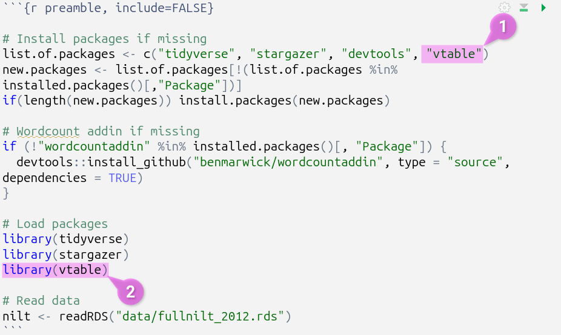
```

As a gif:

```{r echo=FALSE}
knitr::include_graphics("./images/addingpackages.gif")
```

**Note**, moving all code for installing and loading of packages into this preamble code chunk means you do not need, and can safely remove, any other install.package() and library() lines from the rest of your code chunks. This will reduce risk of encountering error messages and make it easier to bug them if any do occur.

### Word Count Code {.unnumbered}

Tables, figures, and code are not included in the word count. The project template is setup with a "word count add-in", that will add a word count for you at the top of your knitted document. Note, you will need to knit your document each time you want to check the updated word count.

This is how the code to calculate the word count looks within the RMarkdown file:

```{r echo=FALSE}
knitr::include_graphics("./images/wordcountinline.png")
```

Side-note, surrounding code with single back-ticks, (/\`), creates an "inline code chunk", enabling you to add short snippets of code. The `r` at the start specifies that the code is R, similar to adding r in curly brackets for code chunks.

This is then how it looks when knitting the project template (assuming you haven't added any additional text yet):

```{r echo=FALSE}
knitr::include_graphics("./images/knittedwordcount.png")
```

We use this addin as the built-in RStudio word count, accessed via the 'Edit' menu at the top of the screen, includes all code and comments. So, despite the addin calculating '0', RStudio will provide:

```{r echo=FALSE}
knitr::include_graphics("./images/rstudiowordcount.png")
```

**Important**, the '- 10' in the code is so "Word count:" and each of the headers "Introduction", "Data and method", etc are also not included in the word count. Ensure to update this number to exclude your bibliography from the word count. For example, if your bibliography is 183 words then change the code to `wordcountaddin::word_count("Assignmet2-template.Rmd") - 193`.

### Template Outline {.unnumbered}

The RMarkdown document provided in the project template includes headed sections you can use alongside suggested word count for each and brief summary reminder of what to include in each section. The [Course Handbook](https://moodle.gla.ac.uk/mod/resource/view.php?id=4853189), pages 26-30, provide a more detailed breakdown of what to include in each section.

Screenshot of the outline and commented suggestions:

```{r echo=FALSE}
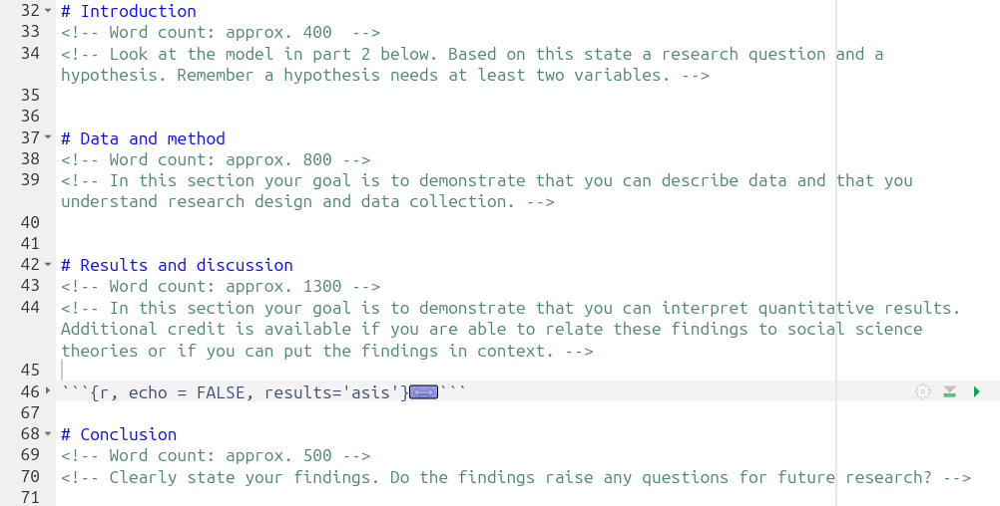
```

**Important**, within the "Results and discussion" section, ensure to add your interpretation *after* the code chunk that creates the regression results table:

```{r echo=FALSE}
knitr::include_graphics("./images/regressioninterpretativeaftercode.png")
```


### Regression Results Code Chunk {.unnumbered}

The code chunk that runs the multiple linear regression model and creates the table with the regression results can be found in the 'Results and discussion' section:

```{r echo=FALSE}
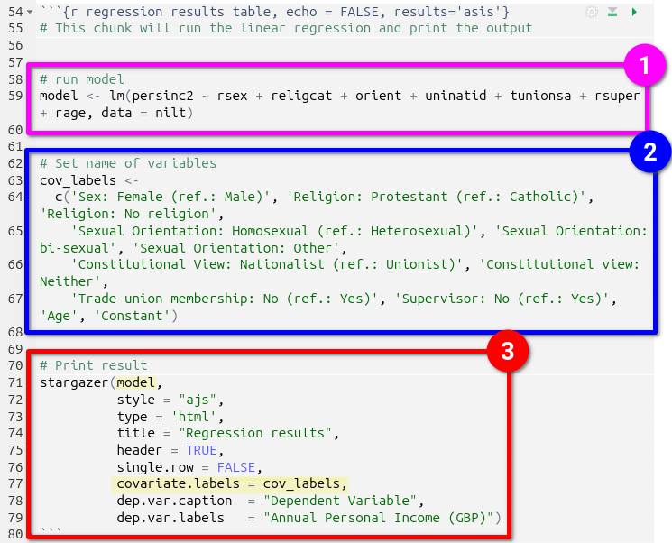
```

1. First the model is run, outlined in pink, and assigned to the `model` object.
2. Next a list with labels to use for the independent and control variables in the regression table is created, outlined in blue, and assigned to the `cov_labels` object.
3. Finally, the stargazer package is used to create the regression results table, outlined in red. It is passed the `model` and `cov_label` objects, highlighted in yellow, alongside arguments for outputting the table in HTML, a title, and caption & label to use for the dependent variable.

Stargazer produces well-formatted regression tables, but with the downside that when running the code chunk in RStudio, you will only see the raw HTML syntax that is created:

```{r echo=FALSE}
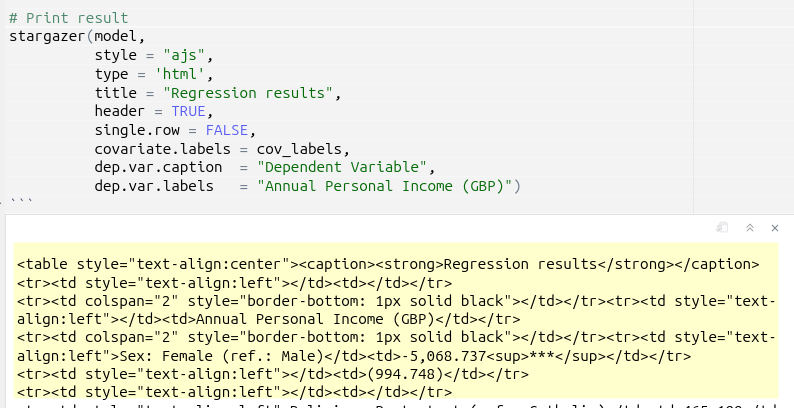
```

In order to view the table, you will need to knit your document and view the outputted HTML file:

```{r echo=FALSE}
knitr::include_graphics("./images/knitting.png")
```

Your knitted HTML file should then open in a new popup window. However, you might instead receive a dialogue window saying that a pop-up was prevented from opening, if so just click 'Try again':

```{r echo=FALSE}
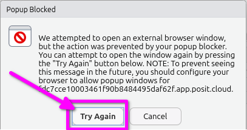
```

Alternatively, you can open the last knitted version of your HTML file from the 'Files' panel. Click the HTML file and select 'View in Web Browser':

```{r echo=FALSE}
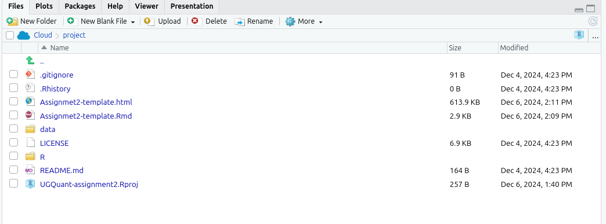
```
Below is how your regression results table should look in the knitted HTML file:

```{r echo=FALSE}
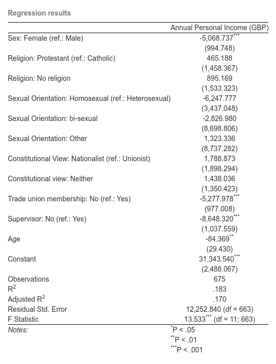
```
If it doesn't, please see the [R Issues FAQ](#RFAQ).
