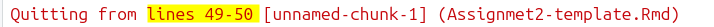
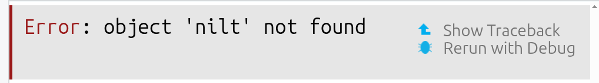
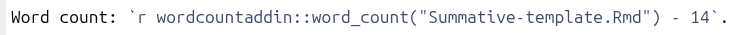
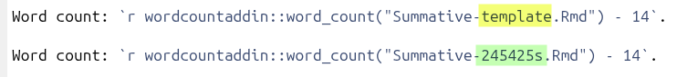
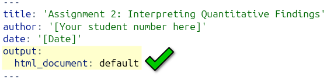
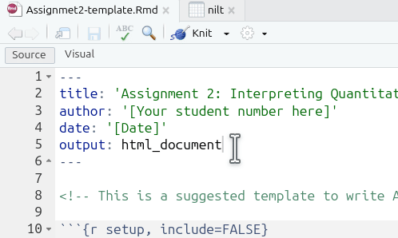
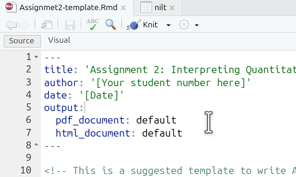
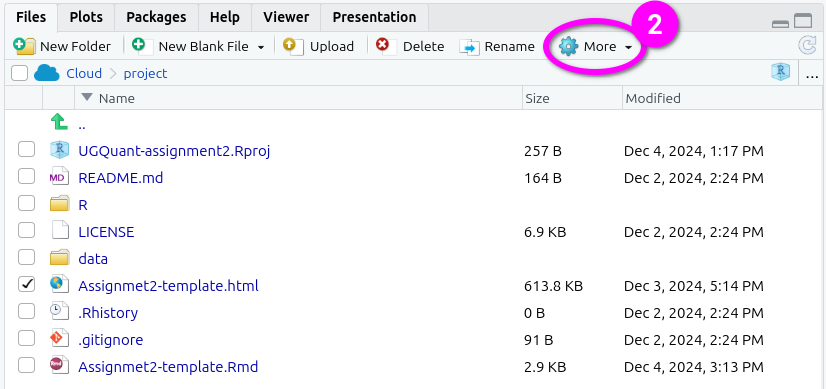
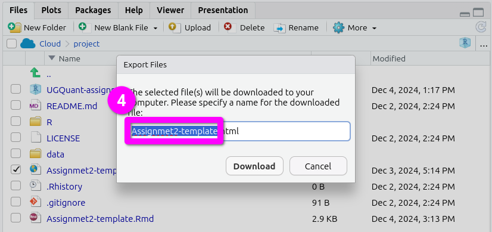
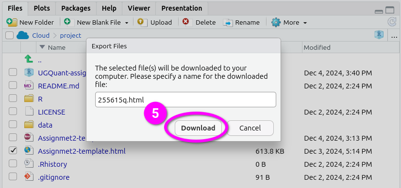

# Appendix: R Issues FAQ {#RFAQ .unnumbered}

## Introduction {.unnumbered}

This appendix contains information for solving common issues reported when working on their interpretive findings report.

Updates will continue being added to this appendix with information for any new issues being reported. So, if you experience an issue, this post will be a good first port of call to check for any existing solution.

## Reporting R Issues {.unnumbered}

When making a Moodle post or emailing about an issue it is vital to provide sufficient context to enable others to help find a solution. This includes:

-   The full text of any error message that you are receiving.
-   Any relevant code that is producing the error.

Error messages will often flag the relevant code chunk where the error occurred:

```{r echo=FALSE}

```

So, based on the above error message you would include the code within the code block at lines 49-50.

Additionally, when emailing, please also include:

-   Your lab group number.
-   If already made a Moodle post about the issue, a link to the post.

## Regression Results Table Issues {.unnumbered}

If variables go missing from your regression results table or the regression results are different to how they originally appeared when you knitted the template, you may have unintentionally replaced the data included with the template.

The preamble code block at the top of the RMarkdown file provide with the template reads in the 'fullnilt_2012.rds' dataset and assigns it to the 'nilt' data frame object.

```{r echo=FALSE}

```

You therefore do not need to download and read in anther dataset, this is all setup for you already within the preamble code block. To resolve the issue, remove all code where you download and assign another dataset to the nilt data frame.

For example, these would be lines to remove:

```{r echo=FALSE}
knitr::include_graphics("./images/removelines.png")
```

The 'NILT2012GR' that we used in the labs has a different set of the NILT variables, and does not contain all the variables in the 'fullnilt_2012' dataset provided in the template. The above code then would result in variables disappearing from your regression results table.

Similarly, this would also be code to remove:

```{r echo=FALSE}
knitr::include_graphics("./images/removelines2.png")
```

The above code replaces the original nilt data frame with a version that only includes the 5 variables listed within the selection function. Again, resulting in variables disappearing from the regression results table.

If you need to create a subset of the data, ensure to assign it to a new data frame:

```{r echo=FALSE}

```

## Object 'nilt_subset' Not Found {.unnumbered}

'Object not found' errors often arise when no data has been assigned to a data frame object. For example, if you ran code using 'nilt_subset', such as `sumtable(nilt_subset, ...)` without first assigning data to it `nilt_subset <- ...`, you would receive the following error message when running/knitting your code:

```{r echo=FALSE}

```

When working with a subset of the data, ensure before the lines identified in the error message that you included code that assigns data to it (`dataframe <- ...`). For example, if you need to work with a subset of data that used filter() or select():

```{r echo=FALSE}
knitr::include_graphics("./images/subsetexamples.png")
```

If you already have code assigning data to the object and do so before the code that is producing the error message, try running the lines of code where you assigning the data again, or 'Run All'. If you still receive an error message, double-check for typos and capitalisation, `nilt_subset`, `NILT_subset`, and `ni1t_subset` will be treated as different objects.

If the code was previously working, it may be the case that you have accidentally deleted code blocks / lines that assigned data to the object, added new code above the lines where you assigned data, or moved code where the lines assigning data to the object and calling it within a function are now in the wrong order.

## Wrong Word Count {.unnumbered}

If the word count displayed at the top of your knitted HTML is wrong, check whether the line of code that calculates the word count refers to the correct RMarkdown file you are using.

Within the template RMarkdown document, we include an inline code block that uses a word count addin to calculate your word count within the knitted HTML file:

```{r echo=FALSE}

```

Which when knitted will look as follows in the HTML file:

```{r echo=FALSE}
knitr::include_graphics("./images/knittedwordcount.png")
```

However, the code to calculate the word count refers to a specific file "Assignmet2-template.Rmd". if you created a new RMarkdown file, such as one that included your student number 'Assignment2-255615q.Rmd', you also need to update the file name in the code:

```{r echo=FALSE}

```
Note, the '- 10' in the code is so "Word count: " and each of the headers "Introduction", "Data and method", etc are also not included in the word count. Ensure to update this number to exclude your bibliography from the word count. For example, if your bibliography is 183 words then change the code to "wordcountaddin::word_count("Assignmet2-template.Rmd") - 193".

## Unable to Knit {.unnumbered}

### Package could not be loaded {.unnumbered}

If receiving a "package '...' could not be loaded" error message, check the YAML code block at the top of your RMarkdown file. Where this error message has occurred previously, it is due to using the 'vtable' package and the YAML code block includes pdf as an output.

You should have either of the following for `output: ...`:

```{r echo=FALSE}
knitr::include_graphics("./images/outputhtml1.png")
```

```{r echo=FALSE}

```

But, will probably have the something like the following if receiving the error message:

```{r echo=FALSE}
knitr::include_graphics("./images/outputhtmlpdf.png")
```
This can happen unintentionally as RStudio can automatically add a line for PDF outline, such as if accidentally clicked 'Knit to PDF':

```{r echo=FALSE}

```

Annoyingly, even if you click 'Knit to HTML' from the options, if your YAML block includes pdf_document in its outputs, R will still try to create a PDF document and keep running into the error message.

So, if you are receiving the error message and have the two output lines, you can easily fix it by removing the pdf_document line:

```{r echo=FALSE}

```

Note, as the YAML block is already specifying to create an HTML output, you can just click the 'Knit' button directly each time rather than clicking the wee down arrow to select 'Knit to HTML' specifically.

### Execution Halted {.unnumbered}

The most common cause of this error is from renaming the RMarkdown file, but not updating the line of code that calculates the word count. See [Wrong Word Count] section for general info.

For example, if you renamed the RMarkdwon file from 'Assignmet2-template.Rmd' to 'Assignment2-255615q.Rmd', you will receive an 'Execution halted' error when trying to knit:

```{r echo=FALSE}
knitr::include_graphics("./images/exechalted.png")
```

To fix it, just update the line of code that calculates the word count so it refers to the new name you have given the file:

```{r echo=FALSE}

```

## Turnitin Unable to Open HTML File {.unnumbered}

To avoid such potential issues, please ensure to submit an exported version of your knitted HTML file rather than one saved through your browser.

If Turnitin is providing an error message that it is unable to open your submitted HTML file, it may be due to having saved the file through your browser (e.g. right-clicking and 'Save as...') rather than exporting it from RStudio. Whilst HTML files saved from the browser and exported from RStudio will look absolutely identical when opened, some browsers - and browser extensions - will add additional code within the HTML file. This additional code does not change how the file looks when opened, but creates issues for Turnitin.

To export your knitted HTML file -
1. Check the box next to your knitted HTML file in the 'Files' panel. By default, the Files panel is on the bottom right of the screen.

```{r echo=FALSE}
knitr::include_graphics("./images/exporthtml1.png")
```
2. Click 'More' from the toolbar at the top of the Files panel.

```{r echo=FALSE}

```

3. Click 'Export' from the menu options that pop-up.

```{r echo=FALSE}
knitr::include_graphics("./images/exporthtml3.png")
```

4. This will pop open an 'Export Files' dialogue. Here, you can rename the file to include your student number. Just make sure the ".html" at the end remains included.

```{r echo=FALSE}

```

5. After naming the file, click 'Download'. This will open a dialogue to select which location to save the file.

```{r echo=FALSE}

```

Here's a short gif running through all the steps together.

```{r echo=FALSE}
knitr::include_graphics("./images/exporthtml.gif")
```

Please note: Don't panic if Turnitin is unable to open your file. We are aware of the issue and you will not be penalised if you submit a file on time, but then have to resubmit after the deadline due to Turnitin being unable to open your original submission.
